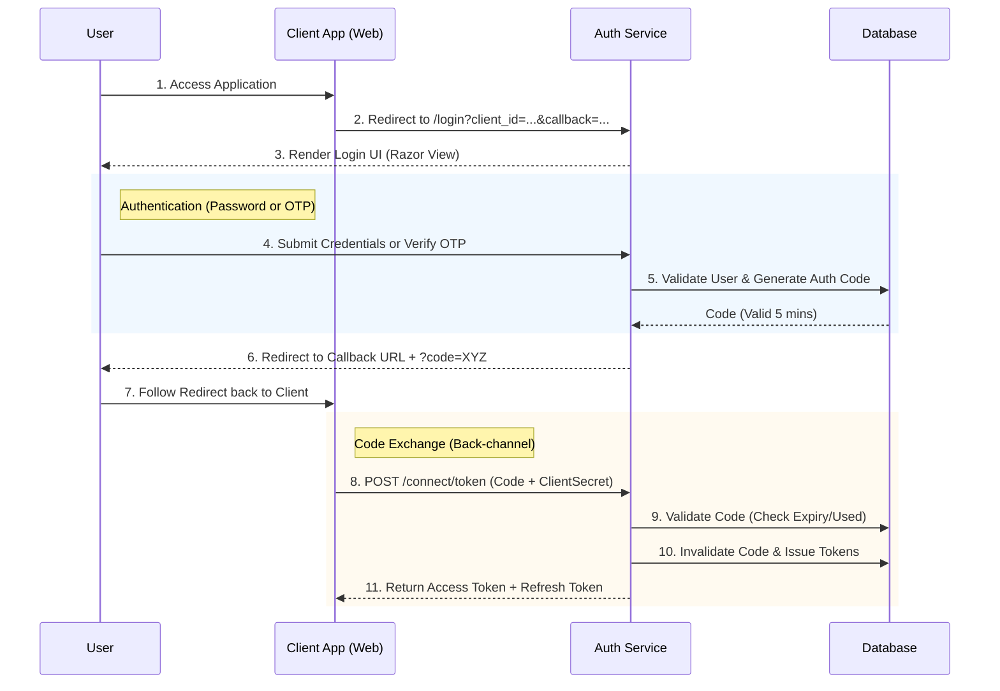

# Auth Service (SSO Module)

A centralized Authentication Service built with **ASP.NET Core**, following **Clean Architecture** principles. This project implements a secure Single Sign-On (SSO) mechanism using the standard **Authorization Code Flow**, supporting both Password and Email OTP authentication methods.

---

## 🇺🇸 English Documentation

### 🚀 Key Features

- **Single Sign-On (SSO):** Centralized login for multiple client applications.
- **Authorization Code Flow:** Standard secure OAuth2 flow:
    1. Login (Password/OTP) -> Receive Authorization Code.
    2. Exchange Code -> Receive Real Access Token & Refresh Token.
- **OTP Authentication:** Secure passwordless login via Email OTP.
- **JWT Management:** Issue and manage Access Tokens and Refresh Tokens (with rotation).
- **Client Management:** Manage third-party client apps (Client ID, Secret, Redirect URIs).
- **Clean Architecture:** Strict separation of concerns (Domain, Application, Infrastructure, API).

### 📊 SSO Authorization Flow

The diagram below illustrates the implemented Authorization Code Flow:



### 🔌 Key API Endpoints

#### SSO (External Flow)
| Method | Endpoint | Description |
|--------|----------|-------------|
| GET | `/login` | Render Login UI (Requires `client_id`, `callback`) |
| POST | `/login` | Handle Password Login -> Redirect with Code |
| POST | `/external/otp/verify` | Handle OTP Verification -> Redirect with Code |
| POST | `/connect/token` | Exchange Auth Code for Real Tokens |

#### Internal Auth
| Method | Endpoint | Description |
|--------|----------|-------------|
| POST | `/api/auth/login` | Direct Login (Returns Token) |
| POST | `/api/auth/refresh` | Refresh Access Token |
| POST | `/api/auth/otp/send` | Send OTP Email |

---

## 🇻🇳 Tài liệu Tiếng Việt

### 🚀 Tính năng nổi bật

- **Đăng nhập một lần (SSO):** Hệ thống xác thực tập trung cho nhiều ứng dụng vệ tinh.
- **Quy trình Authorization Code:** Chuẩn bảo mật OAuth2 được khuyến nghị:
    1. Đăng nhập (Mật khẩu/OTP) -> Nhận mã Authorization Code.
    2. Đổi Code -> Nhận Access Token & Refresh Token thật.
- **Xác thực OTP:** Hỗ trợ đăng nhập không cần mật khẩu qua mã OTP gửi về Email.
- **Quản lý JWT:** Cấp phát, xác thực và làm mới Token an toàn.
- **Quản lý Client:** Quản lý các ứng dụng kết nối (Client ID, Secret, Callback URLs).
- **Kiến trúc sạch:** Tách biệt rõ ràng logic nghiệp vụ và hạ tầng.

### 🛠️ Cài đặt & Chạy ứng dụng

#### 1. Yêu cầu hệ thống
- .NET SDK 8.0 trở lên
- Docker Desktop (tùy chọn)
- SQL Server

#### 2. Chạy với Docker Compose (Khuyên dùng)
```bash
docker-compose up -d --build
```

#### 3. Chạy môi trường Local (Dev)
Cấu hình chuỗi kết nối trong `appsettings.json` và chạy lệnh:

```bash
# Cập nhật Database (Migrations)
dotnet ef database update

# Khởi chạy ứng dụng
dotnet run --project authModule.csproj
```

### 📁 Cấu trúc thư mục

```
src/
├── Common/          # Các class chung (Helpers, Pagination...)
├── Controllers/     # API Endpoints & MVC Controllers
├── Data/            # DbContext và Data Seeding
├── DTOs/            # Data Transfer Objects (Request/Response models)
├── Models/          # Domain Entities (User, AuthorizationCode, Client...)
├── Services/        # Business Logic (AuthService, ExternalService...)
├── Views/           # Razor Views (Giao diện đăng nhập Minimalist)
└── Program.cs       # Cấu hình DI và Middleware
```

---
© 2026 Auth Service Project. Internal Use Only.
